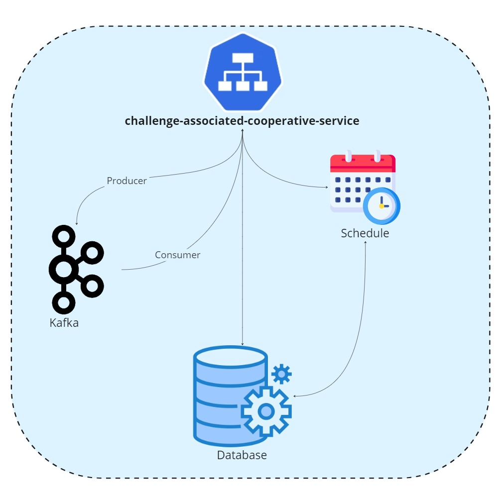

# Desafio Votação para Associados Cooperativistas
Challenge Associated Cooperative Service

## Objetivo:
No cooperativismo, cada associado possui um voto e as decisões são tomadas em assembleias, por votação. Imagine que você deve criar uma solução backend para gerenciar essas sessões de votação.

## Funcionalidades
- Cadastrar e consultar associados
- Cadastrar e consultar assembleias
- Cadastrar  e consultar pautas
- Definir ou não o tempo das pautas
- Gerencia automática de encerramento das Pautas
- Registrar votos dos associados nas pautas durante as assembleias
- Gerar relatórios com os resultados das votações
- Capacidade de receber massas de votos por minuto

### Tecnologias Utilizadas
Java 17, Spring Boot 3 e PostgressSQL.

### Pré-Requisitos
- Docker instalado<br>

### Como subir o projeto
Execute o docker compose na raíz do projeto:
`````
docker-compose up -d
`````
- Backend
- Banco de Dados
- Kafka
- Zookeeper

### [Swagger](http://localhost:8080/swagger-ui/index.html)
`````
http://localhost:8080/swagger-ui/index.html
`````
### [Actuator](http://localhost:8080/actuator)
`````
http://localhost:8080/actuator
`````
### Arquitetura do Projeto

